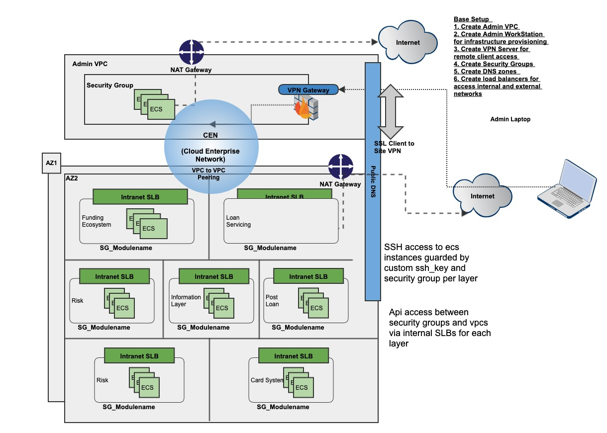

# CloudBuilder

Terraform modules for provisoning infrastructure & environment on demand on public cloud platforms. 

## Cloud Provider Support 

1. [Alicloud](https://www.terraform.io/docs/providers/alicloud/index.html)

2. AWS (To be added)

## Directory Structure

	├── BaseSetup.tf  =>  This creates the end to end infrastrure as per the Architecture Diagram.
	├── Cloud_EOD.jpg =>  Sample Infra Architecture used for this setup.
	├── README.md
	├── infra  =>  Modules for managing infrastructure resources like vpc, dns, identity etc.       
	│   ├── admin_vpc
	│   │   ├── main.tf
	│   │   ├── output.tf
	│   │   └── variables.tf
	│   ├── dns-public
	│   │   ├── main.tf
	│   │   └── variables.tf
	│   ├── ram
	│   │   ├── main.tf
	│   │   └── variables.tf
	│   └── tenant_vpc
	│       ├── main.tf
	│       ├── output.tf
	│       └── variables.tf
	├── modules  =>  Modules for shared services across vpcs like load balancer, vpn gateway setup.
	│   ├── slb
	│   │   ├── main.tf
	│   │   ├── output.tf
	│   │   └── variables.tf
	│   └── vpn-gateway
	│       ├── ssl-vpn.tf
	│       └── variables.tf
	├── provider.tf => Contains provider specific information.
	├── roles  =>  Modules to provision application related resources.
	│   └── funding
	│       ├── main.tf
	│       ├── output.tf
	│       └── variables.tf

## Sample Infrastructure Design

